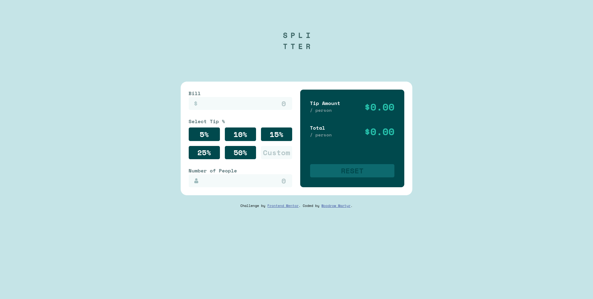
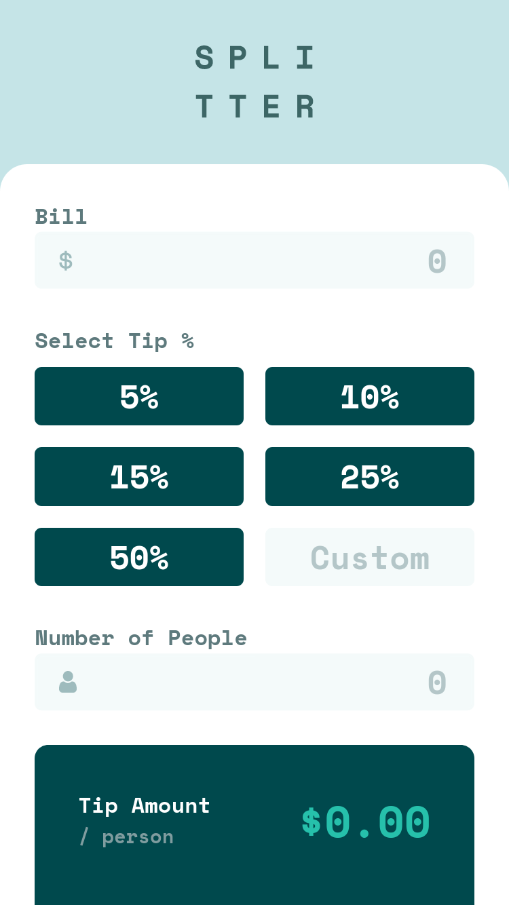

# Frontend Mentor - Tip calculator app solution

This is a solution to the [Tip calculator app challenge on Frontend Mentor](https://www.frontendmentor.io/challenges/tip-calculator-app-ugJNGbJUX). Frontend Mentor challenges help you improve your coding skills by building realistic projects.

## Table of contents

- [Overview](#overview)
  - [The challenge](#the-challenge)
  - [Screenshot](#screenshot)
  - [Links](#links)
- [My process](#my-process)
  - [Built with](#built-with)
  - [What I learned](#what-i-learned)
  - [Continued development](#continued-development)
  - [Useful resources](#useful-resources)
- [Author](#author)

## Overview

### The challenge

Users should be able to:

- View the optimal layout for the app depending on their device's screen size
- See hover states for all interactive elements on the page
- Calculate the correct tip and total cost of the bill per person

### Screenshot

### Links

- Solution URL: [https://github.com/wmartyr/tip-calculator-app-main](https://github.com/wmartyr/tip-calculator-app-main)
- Live Site URL: [https://wmartyr.github.io/tip-calculator-app-main](https://your-live-site-url.com)

## My process

### Built with

- Semantic HTML5 markup
- CSS custom properties
- Flexbox
- CSS Grid
- Mobile-first workflow

### What I learned

This gave me a chance to practice more JS especially with DOM manipulations and events.

### Continued development

I'm still trying to see if I can better optimise the code. I created a number of classes that turned out to be not needed. I'm hoping I can get better the more I practice.

### Useful resources

- [https://css-tricks.com/snippets/css/complete-guide-grid](https://css-tricks.com/snippets/css/complete-guide-grid) - This helped me for setting up the tip presets. It came in handy in the transition from mobile to desktop.
- [https://gist.github.com/Asjas/4b0736108d56197fce0ec9068145b421](https://gist.github.com/Asjas/4b0736108d56197fce0ec9068145b421) - I use this one to setup my CSS.
- [https://www.theodinproject.com/lessons/foundations-dom-manipulation-and-events](https://www.theodinproject.com/lessons/foundations-dom-manipulation-and-events) - This is what I always come back to when doing DOM manipulations.
- [https://css-tricks.com/snippets/css/a-guide-to-flexbox](https://css-tricks.com/snippets/css/a-guide-to-flexbox/) - Another go-to reference that I always use.

## Author

- Website - [https://github.com/wmartyr](https://github.com/wmartyr)
- Frontend Mentor - [@wmartyr](https://www.frontendmentor.io/profile/wmartyr)
